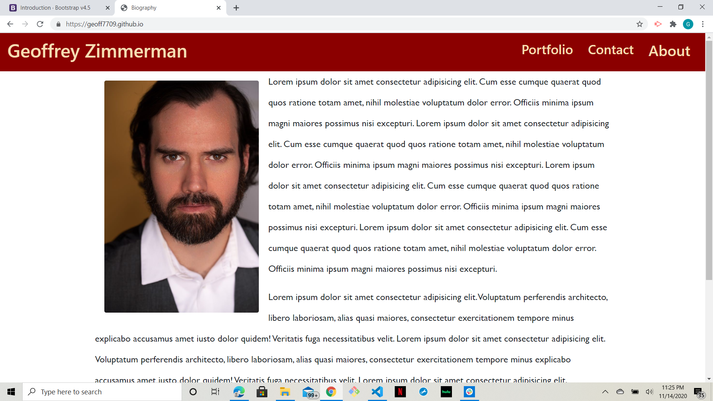
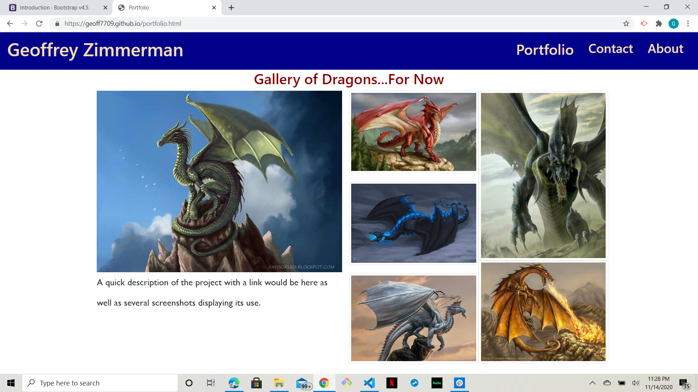
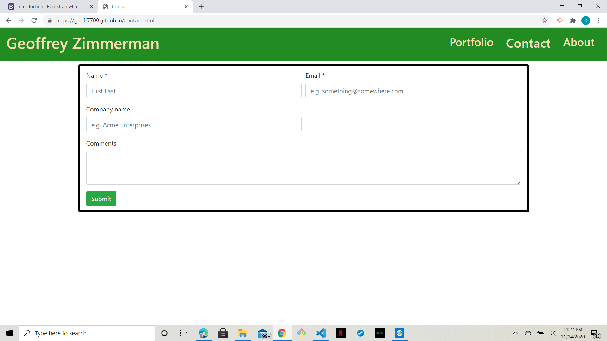

# Portfoloio Project

## Objectives:
The purpous of this project is to begin mapping out the perameters of a GitHub portfolio page. At this point in my career, I have very limited experience in coding and absolutely no professional credentials. The end result, however, will be a full-fledged portfolio and resume page with a completely active and usable contact page.In short, the model followed opens on a biography page with headshot and placeholder text:

The placeholder text will be replaced with a formated resume as more skills are learned. It's included presently mainly to demonstrate the utility of the page.

Next is the portfolio page:

As future projects and assignments are completed, they will be added in place of placeholder images. The plan is also to include links to relavant applications.

Finally, there is a contact page:

This contact was based on a form found on the web. The link with the base code is included in the [Reference Links](ReferenceLinks/Links.txt) along with links to all the photos used on the page. There are also portions of the code commented out that I have kept for possible future use.

[Here](https://geoff7709.github.io/) is the link for the final product.

## Resources

Below I have incuded direct links for all of the photos used on the page for easier viewing:
* [Geoffrey Zimmerman](Images/GeoffZ.JPG)
* [European Dragon](Images/European-Dragon1.jpg)
* [Black Dragon](Images/Black-Dragon.jfif)
* [Blue Dragon](Images/Blue-Dragon.jpg)
* [Gold Dragon](Images/Gold-Dragon.jpg)
* [Red Dragon](Images/Red-Dragon.jpg)
* [Silver Dragon](Images/Silver-Dragon.jpg)
